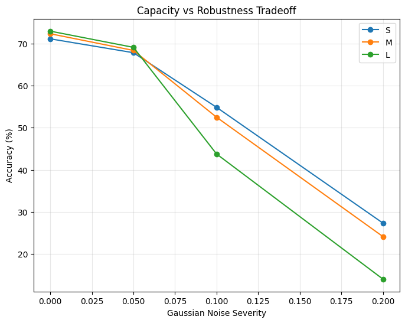

# Asymmetric Distillation and Information Retention

**An Empirical Study on Dimensional Collapse and Robustness Transfer Failure in Capacity-Constrained Cross-Modal Transfer.**

📄 **[Read the Full Paper Here](./Asymmetric%20Distillation%20and%20Information%20Retention%20in%20Capacity-Constrained%20Cross-Modal%20Transfer.pdf)**

This repository contains the rigorous PyTorch evaluation pipeline for analyzing the spectral geometry, mutual information retention, and robustness of CNN Students distilled from a massive, frozen CLIP (ViT-B/32) Teacher.

## 📌 Research Overview
When compressing massive vision-language models for edge deployment, standard Knowledge Distillation forces a global-receptive-field transformer into a local-receptive-field CNN. This project investigates the geometric consequences of that asymmetric bottleneck and its devastating impact on high-frequency noise robustness.

By enforcing strict mathematical constraints—specifically embedding centering and seed-locked stochasticity—we evaluate whether increasing a student's capacity expands its dimensional footprint, or merely packs information more densely at the cost of fragility.

### Key Discoveries:
1. **Capacity-Agnostic Dimensional Collapse:** Despite the CLIP Teacher spanning an Effective Rank of 88.68, all Student models (from 0.5M to 8.0M parameters) suffered catastrophic dimensional collapse to an identical Effective Rank of ~16.
2. **Robustness Transfer Failure:** The Teacher utilizes its 88 dimensions to maintain high noise immunity (89.35% accuracy at σ=0.1 noise). Distillation destroys this redundancy. 
3. **The Inverse Scaling Law (The Trade-off):** Within the 16-dimensional bottleneck, the 8.0M overparameterized student densely packs clean data but becomes hyper-brittle (crashing to 43.76% under noise). Conversely, the extreme physical constraints of the 0.5M student act as a robust low-pass filter, significantly outperforming the larger model (54.84%) under noise.
4. **The Physical Bottleneck:** Explicit spatial augmentation failed to restore the larger student's robustness, proving this fragility is a fundamental geometric limitation of the ~16D bottleneck, not a behavioral training flaw.

## 📊 Visual Proofs

### 1. Implicit Truncated PCA (Geometric Bottleneck)
All students, regardless of parameter count, capture >90% of their variance strictly within the Teacher's top 20 principal components.


### 2. The Capacity vs. Robustness Tradeoff
The crossover effect under high-frequency Gaussian noise. The heavily constrained 0.5M model (S) overtakes the 8.0M model (L) due to its inability to overfit to fine-grained, fragile artifacts.



## ⚙️ Methodology & Pipeline Rigor
The codebase is heavily optimized while maintaining strict academic rigor:
* **Centered SVD Math:** True structural variance is isolated from mean-vector artifacts before extracting the Shannon Entropy Effective Rank.
* **FP32 Precision Locking:** Prevents precision mismatch crashes between the FP16 CLIP Teacher and FP32 custom Students during InfoNCE cross-entropy calculations.
* **Multi-Seed Evaluation:** Robustness metrics and linear probe accuracies are averaged across stochastic runs to provide peer-review-grade error bounds.

## 🚀 Running the Code
The entire experiment, including the augmentation control checks and information-theoretic evaluation, is contained within a single, sequential Jupyter Notebook: `Asymmetric_Distillation_Phase_Collapse.ipynb`.

### Prerequisites:
```bash
pip install torch torchvision numpy matplotlib scikit-learn tqdm
pip install git+https://github.com/openai/CLIP.git
```

## 📈 Final Results Summary

| Model | Params | Effective Rank | Clean Acc | Noise Robustness (σ=0.1) |
| :--- | :--- | :--- | :--- | :--- |
| **Teacher (CLIP)** | 500M | 88.68 | 94.31% | 89.35% |
| **Student-S** | ~0.5M | ~15.91 | 71.11% | 54.84% ± 3.73% |
| **Student-L** | ~8.0M | ~16.66 | 72.94% | 43.76% ± 6.10% |

***